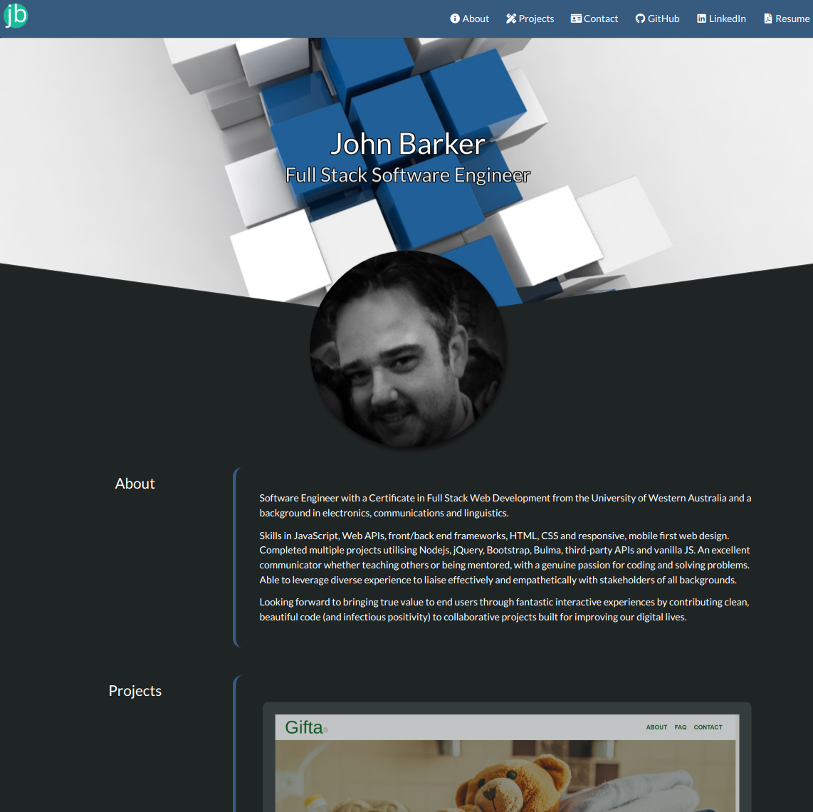

# Portfolio

## Description

This repository contains John Barker's portfolio.

It uses the _Bulma_ to achieve a clean, polished and responsive UI.

It showcases previous projects, a resume, contact information and links to GitHub and LinkedIn profiles.

## Usage

The deployed website can be viewed here: https://dandycodes.github.io/portfolio/

## Credits

https://bulma.io/

https://developer.mozilla.org/en-US/

https://www.w3schools.com/

## License

Copyright (c) John Barker. All rights reserved.

Licensed under the [MIT](LICENSE) license.
